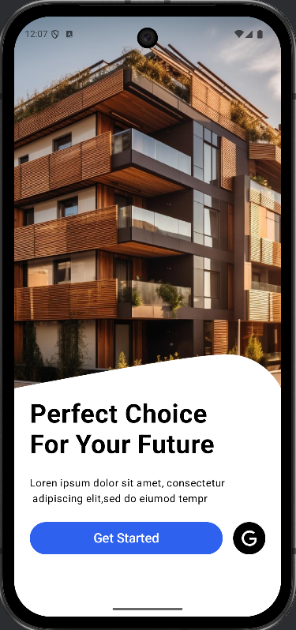
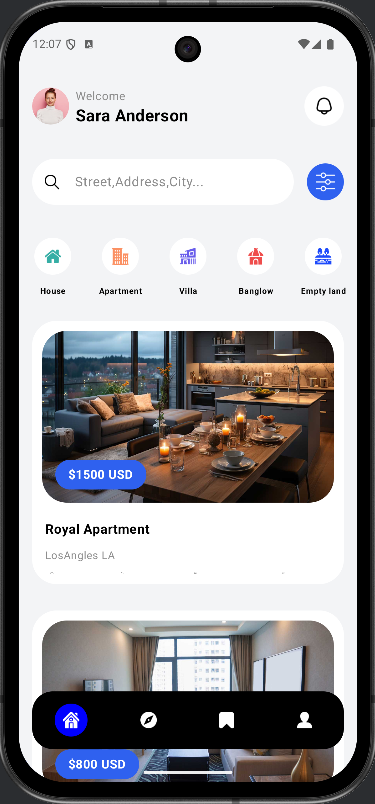
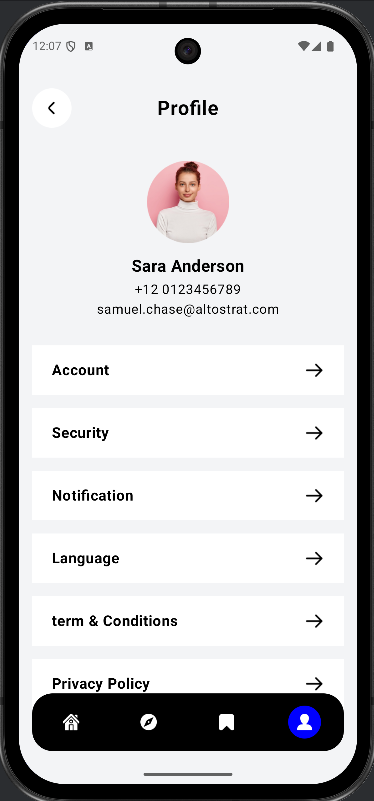

# 🏡 Real Estate App

A modern **Real Estate Android application** built with **Kotlin & Jetpack Compose**.  
The app features **bottom navigation**, **splash screen**, and a clean **UI for browsing properties**.  

---

## 🚀 Features

- 📱 **Jetpack Compose UI** – Modern, declarative Android UI toolkit  
- 🔖 **Bottom Navigation** – Navigate between Home, Explorer, Bookmark, and Profile  
- 🎬 **Splash Screen** – Smooth entry point into the app  
- 🏘 **Property Listings** – Sample real estate properties with details  
- ⚡ **State Restoration** – Preserves navigation state across screens  

---

## 📸 Screenshots

| Splash Screen | Home Screen | Profile Screen |
|---------------|-------------|--------------------|
|  |  |  |

---

##  Tech Stack

- **Language:** [Kotlin](https://kotlinlang.org/)  
- **UI Toolkit:** [Jetpack Compose](https://developer.android.com/jetpack/compose)  
- **Navigation:** [Navigation-Compose](https://developer.android.com/jetpack/compose/navigation)  
- **Material 3:** Modern Material Design components  
- **Architecture:** MVVM-ready structure  

---

## Author

 - **Vimal Chaudhary**

- **LinkedIn: Vimal Chaudhary**

- **Email: vimal07chaudhary@gmail.com**
